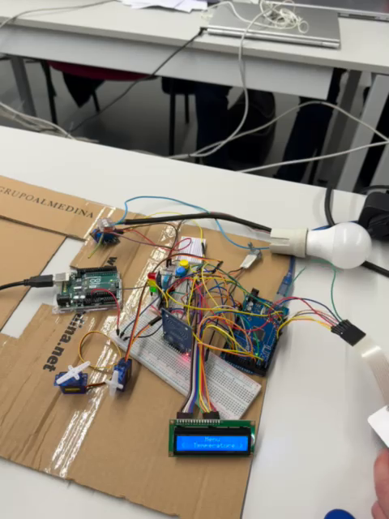

# smart-access-controller

Smart Access Controller is an Arduino-based system that integrates RFID authentication, keypad input, LCD menus, and environmental sensors to provide both secure access control and environment monitoring. With its intuitive keypad and display, users can view and adjust temperature, humidity, and luminosity settings in real time. Servo motors and relays extend functionality to physical mechanisms, enabling actions such as door unlocking or device activation. Designed for flexibility, SmartAccess Controller combines security, automation, and smart environment management into a single compact solution.

[]
